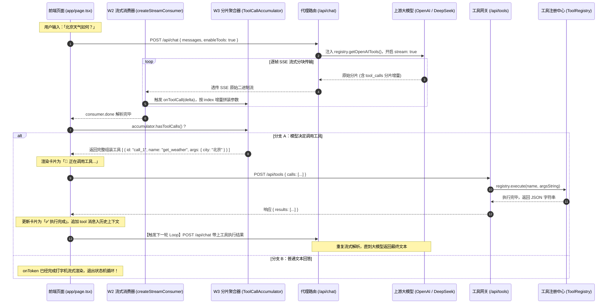

# W3 实战教程：手写 AI Agent 工具调用引擎 —— Function Calling 与工具调用全栈落地

> **作者寄语**：  
> 面对大模型应用开发，许多前端同学容易陷入两个极端：要么止步于简单的流式打字机，做做“套壳聊天”；要么直接搬来 LangChain、Vercel AI SDK 等重型框架，面对成百上千行的黑盒抽象不知所措。  
> **真正的 AI 智能体（Agent），并不是魔法，它的本质是一个带有工具调度能力的有限状态机（Finite State Machine）**。  
> 在 W2 中，我们亲手打造了生产级的 Web Streams 流式解析引擎；而在 W3 中，我们将兑现在 W2 底层预埋的接口约定，**以“极小侵入、增量演进”的工程化设计**，将纯聊天的流式引擎升级为一个能查实时网络、能执行本地数学运算、具备错误自省重试能力的工业级 AI Agent！

---

## 🚀 5 分钟极速上手

本项目完全向下兼容 W2 的所有流式特性（包括 60fps rAF 攒批打字机、DeepSeek R1 深度思考双轨分流等），并新增了完整的 Function Calling 工具调用全栈运行时。

### 1. 安装依赖

```bash
npm install
```

> 本项目仅在 W2 基础上新增了 `zod`（运行时参数强类型验证）与 `zod-to-json-schema`（自动将 Zod 模型转换为 OpenAI 兼容的 JSON Schema），核心流式传输依旧保持**零外部重型框架依赖**。

### 2. 配置环境变量

从模板复制本地配置文件：

```bash
cp .env.example .env.local
```

编辑 `.env.local`，填入你的 OpenAI 兼容配置（支持 OpenAI 官方、DeepSeek、通义千问、Kimi 或本地免费的 Ollama）：

```ini
# 必填：API Key（仅服务端读取，绝不泄露给前端客户端）
OPENAI_API_KEY=sk-xxxxxxxxxxxxxxxxxxxxxxxx

# 必填：接口 Base URL（末尾不加 /）
OPENAI_BASE_URL=https://api.openai.com/v1

# 选填：大模型标识（默认使用 gpt-4o-mini）
OPENAI_MODEL=gpt-4o-mini

# 选填：Agent Loop 最大轮次防御限制（防止模型陷入调用死循环，默认 5）
AGENT_MAX_STEPS=5
```

> 💡 **零成本本地运行**：如果使用本地 Ollama（如运行 `ollama run qwen2.5:7b`），可直接配置 `OPENAI_BASE_URL=http://localhost:11434/v1` 和 `OPENAI_API_KEY=ollama`，完全免 Token 费用。

### 3. 启动开发服务器

```bash
npm run dev
```

打开浏览器访问 [http://localhost:3000](http://localhost:3000)，你可以在输入框尝试以下典型指令，体验智能体工具调用的完整生命周期：

- 🌤️ **本地模拟工具**：「北京今天天气怎么样？」
  - Agent 识别城市参数，自动触发 `get_weather`，返回结构化气象数据并整理回答。
- 📦 **真实网络 API**：「查一下 react 这个 npm 包的最新版本和每周下载量」
  - Agent 自动向 `registry.npmjs.org` 和 `api.npmjs.org` 发起真实 HTTP 查询，经服务端数据瘦身后回传总结。
- 🧮 **本地安全计算**：「12345 乘以 6789 等于多少？」
  - Agent 将复杂数学计算委托给沙箱化本地计算器 `calculate` 工具，给出精准计算结果。
- 🔄 **并行工具调用**：「帮我同时查一下 next 这个包的信息，并计算 1024 的平方」
  - Agent 单次响应同时派发两个工具任务，前端并行触发，服务端通过 `Promise.all` 并发执行。

---

## 📁 项目目录结构树

```text
w3-tool-chat/
├── lib/
│   ├── stream-parser/               # 【W2 核心基础设施·100%复用】生产级流式解析引擎
│   │   ├── core/                    # 数据流管道与调度（TextDecoder, SSE 切分, rAF 攒批）
│   │   │   ├── types.ts             # 契约定义（预埋 ToolCallDelta 接口）
│   │   │   ├── sse-parser.ts        # WHATWG 规范合规流式切分
│   │   │   └── transforms/          # 字节转换流与 Token 渲染调度器
│   │   ├── adapters/                # 厂商协议适配层（OpenAI, Claude）
│   │   │   └── openai.ts            # 工业级防御（已内置 extractToolCallDelta）
│   │   ├── consumer/                # 统一门面 Facade
│   │   │   └── stream-consumer.ts   # 消费客户端（预埋 onToolCall 回调钩子）
│   │   └── index.ts                 # 统一出口导出
│   │
│   └── agent/                       # 【★ W3 新增核心模块】AI Agent 运行时体系
│       ├── types.ts                 # Agent 核心接口（AssembledToolCall, ToolDefinition 等）
│       ├── tool-call-accumulator.ts # 流式分片聚合器（按 index 聚合并行 tool_call 增量）
│       ├── tool-registry.ts         # 类型安全工具注册中心（Zod 转 JSON Schema + 执行防护）
│       ├── agent-loop.ts            # 通用 Agent Loop 状态机引擎（用于无UI环境或单测）
│       ├── tools/                   # 内置示范工具库
│       │   ├── weather.ts           # 🌤️ 天气查询（模拟数据 + 确定性哈希种子）
│       │   ├── npm-search.ts        # 📦 npm 包查询（真实 API + 数据瘦身技术）
│       │   └── calculator.ts        # 🧮 本地计算器（正则白名单 + 关键词黑名单防注入）
│       └── index.ts                 # 模块出口
│
├── app/
│   ├── api/
│   │   ├── chat/route.ts            # 【W2 增量改造·仅改 4 行】服务端 SSE 代理 + tools 透传
│   │   └── tools/route.ts           # 【★ W3 新增端点】服务端工具执行网关（密钥保护与 I/O 并发）
│   └── page.tsx                     # 【W2 增量改造】客户端 Agent Loop + 状态机可视化 UI
│
├── __tests__/                       # 自动化测试矩阵（共 53 项全绿通过）
│   ├── tool-call-accumulator.test.ts# 【W3】聚合器流式多分片与并行组装单测（6 项）
│   ├── tool-registry.test.ts        # 【W3】工具注册与 Schema 导出单测（7 项）
│   ├── agent-loop.test.ts           # 【W3】Agent 状态机多轮执行单测（8 项）
│   ├── sse-parser.test.ts           # 【W2】复用 SSE 切分测试（12 项）
│   ├── adapters.test.ts             # 【W2】复用适配器防御测试（13 项）
│   └── consumer.test.ts             # 【W2】复用流式消费测试（7 项）
│
├── package.json                     # 依赖定义与运行脚本
└── .env.example                     # 环境变量配置文件模板
```

---

## 🗺️ 全景数据流动与时序图

在进入代码细节前，请先建立清晰的端到端调用时序模型。在客户端驱动的架构下，一次包含工具调用的会话经历以下完整流转：



---

## 目录

- [第 1 章：第一性原理：从“纯聊天”到“智能体行动”](#第-1-章第一性原理从纯聊天到智能体行动)
  - [1.1 纯文本大模型的“三大约束”与真实翻车案例](#11-纯文本大模型的三大约束与真实翻车案例)
  - [1.2 Function Calling 的技术本质：模型不执行代码](#12-function-calling-的技术本质模型不执行代码)
  - [1.3 承接 W2：重温预埋通道与增量演进设计](#13-承接-w2重温预埋通道与增量演进设计)
- [第 2 章：协议标准精讲与流式分片暗坑剖析](#第-2-章协议标准精讲与流式分片暗坑剖析)
  - [2.1 请求协议：tools 与 tool_choice 的四种模式](#21-请求协议tools-与-tool_choice-的四种模式)
  - [2.2 响应结构与 finish_reason: "tool_calls"](#22-响应结构与-finish_reason-tool_calls)
  - [2.3 流式分片时序三大暗坑推导](#23-流式分片时序三大暗坑推导)
  - [2.4 上下文闭环：role: "tool" 消息与 ID 匹配机制](#24-上下文闭环role-tool-消息与-id-匹配机制)
- [第 3 章：手写实战 1：流式分片聚合器 (ToolCallAccumulator)](#第-3-章手写实战-1流式分片聚合器-toolcallaccumulator)
  - [3.1 痛点场景：直接拼字符串会发生什么？](#31-痛点场景直接拼字符串会发生什么)
  - [3.2 领域契约定义 (`lib/agent/types.ts`)](#32-领域契约定义-libagenttypests)
  - [3.3 核心实现与逐行推导 (`lib/agent/tool-call-accumulator.ts`)](#33-核心实现与逐行推导-libagenttool-call-accumulatorts)
  - [3.4 单元测试对账：验证并行双工具交叉到达](#34-单元测试对账验证并行双工具交叉到达)
- [第 4 章：手写实战 2：类型安全工具系统与三大核心工具手写](#第-4-章手写实战-2类型安全工具系统与三大核心工具手写)
  - [4.1 痛点场景：大模型幻觉与参数崩溃，为什么报错绝不能 throw？](#41-痛点场景大模型幻觉与参数崩溃为什么报错绝不能-throw)
  - [4.2 工具注册中心与“错误作为数据回传”理念 (`lib/agent/tool-registry.ts`)](#42-工具注册中心与错误作为数据回传理念-libagenttool-registryts)
  - [4.3 示范工具 1：🌤️ 天气查询工具与确定性哈希 (`lib/agent/tools/weather.ts`)](#43-示范工具-1-天气查询工具与确定性哈希-libagenttoolsweatherts)
  - [4.4 示范工具 2：📦 npm 查询工具与“数据瘦身”关键技术 (`lib/agent/tools/npm-search.ts`)](#44-示范工具-2-npm-查询工具与数据瘦身关键技术-libagenttoolsnpm-searchts)
  - [4.5 示范工具 3：🧮 本地计算器与 RCE 防代码注入攻防 (`lib/agent/tools/calculator.ts`)](#45-示范工具-3-本地计算器与-rce-防代码注入攻防-libagenttoolscalculatorts)
- [第 5 章：手写实战 3：通用 Agent Loop 状态机引擎 (`lib/agent/agent-loop.ts`)](#第-5-章手写实战-3通用-agent-loop-状态机引擎-libagentagent-loopts)
  - [5.1 痛点场景：如何让 Agent 脱离 UI 独立运行与测试？](#51-痛点场景如何让-agent-脱离-ui-独立运行与测试)
  - [5.2 状态机模型与依赖注入设计思考](#52-状态机模型与依赖注入设计思考)
  - [5.3 状态机源码逐行拆解 (`lib/agent/agent-loop.ts`)](#53-状态机源码逐行拆解-libagentagent-loopts)
- [第 6 章：手写实战 4：服务端最小侵入流式改造与独立工具网关](#第-6-章手写实战-4服务端最小侵入流式改造与独立工具网关)
  - [6.1 服务端架构决策：为什么将流式代理与工具执行拆分为两个端点？](#61-服务端架构决策为什么将流式代理与工具执行拆分为两个端点)
  - [6.2 仅改 4 行的流式代理升级 (`app/api/chat/route.ts`)](#62-仅改-4-行的流式代理升级-appapichatroutets)
  - [6.3 独立工具执行端点实现 (`app/api/tools/route.ts`)](#63-独立工具执行端点实现-appapitoolsroutets)
- [第 7 章：手写实战 5：客户端 Agent Loop 状态机与 60fps 平滑打字机 (`app/page.tsx`)](#第-7-章手写实战-5客户端-agent-loop-状态机与-60fps-平滑打字机-apppagetsx)
  - [7.1 痛点场景：为什么不能由服务端阻塞死等所有工具执行完再返回？](#71-痛点场景为什么不能由服务端阻塞死等所有工具执行完再返回)
  - [7.2 精确消息追踪：为什么必须引入 genId()？](#72-精确消息追踪为什么必须引入-genid)
  - [7.3 完整前端页面实现与中文拆解 (`app/page.tsx`)](#73-完整前端页面实现与中文拆解-apppagetsx)
- [第 8 章：测试驱动验证（TDD）：53 项严苛单测全景覆盖](#第-8-章测试驱动验证tdd53-项严苛单测全景覆盖)
  - [8.1 测试矩阵概览](#81-测试矩阵概览)
  - [8.2 核心单测深度解析](#82-核心单测深度解析)
  - [8.3 终端全绿验证报告](#83-终端全绿验证报告)
- [第 9 章：总结与进阶展望](#第-9-章总结与进阶展望)

---

## 第 1 章：第一性原理：从“纯聊天”到“智能体行动”

### 1.1 纯文本大模型的“三大约束”与真实翻车案例

在 W1 与 W2 中，我们构建了生产级的流式打字机，实现了极致的响应速度。然而，只要应用面对复杂生产场景，纯文本大模型（Text-only LLM）的底层局限就会暴露无遗：

1. **时效盲区（Temporal Blindness）**：大模型的参数在预训练完成后即被固化，它不知道今天纳斯达克的点位、今天的气温，甚至不知道当前现实世界的精确时间。
2. **系统隔离（System Isolation）**：大模型处于隔离环境，无法读写企业内网数据库，无法向飞书/企业微信发送告警，也无法发起真实的 HTTP 请求。
3. **计算黑洞（Computational Black Hole）**：大模型本质是基于注意力机制的概率模型，按 Token 概率推测下一个字。它**没有计算机硬件中的 ALU（算术逻辑单元）与进位标志寄存器**。

#### 真实翻车案例：大模型计算 $8794351234.12 \times 9642875678.32$

如果我们禁止大模型调用任何计算器或代码解释器工具，只让当前最先进的大模型纯脑算：
- **CPU 真实精确值**：`84802835622099224128.2784`
- **大模型纯脑算值**：`84802837375736735235.9184`
- **结果对比**：
  ```text
  真实精确值: 8 4 8 0 2 8 3 [5 6 2 2 0 9 9 2 2 4 1 2 8] . [2 7 8] 4
  大模型推算: 8 4 8 0 2 8 3 [7 3 7 5 7 3 6 7 3 5 2 3 5] . [9 1 8] 4
  判定结果:   ✅ 命中 7 位   ❌ 中间连续 13 位全盘幻觉崩溃  ❌ 错    ✅
  ```
  **绝对误差高达整整 1.75 万亿！**  
  模型仅猜对了高位数量级（宏观注意力），但由于多位乘法需要处理多达数十次复杂的进位累加，直接击穿了自回归模型的单步工作记忆，中间数字全部变成伪随机幻觉。

### 1.2 Function Calling 的技术本质：模型不执行代码

面对上述缺陷，业界的解法不是盲目扩大模型参数，而是引入 **Function Calling（函数调用）**。

> [!IMPORTANT]
> **请务必牢记：大模型永远不执行任何代码！它只是“决策中枢与调度器”。**

Function Calling 的真实工作闭环如下：
1. **开发者提供工具说明书（JSON Schema）**：在发送请求时，通过 `tools` 参数声明当前可用的工具（包括名称、用途描述、参数约束）。
2. **大模型判断是否需要工具**：
   - 问“李白是谁”：模型自主推断已有常识足以回答，直接返回文本。
   - 问“查一下深圳天气”：模型推断需要实时外部数据，因此**中断自然语言输出**，转而输出一段包含工具名与参数的 JSON 结构体（`get_weather({"city":"深圳"})`）。
3. **宿主程序（你的代码）执行并回传**：你的前端或 Node.js 服务捕获到这一指令，调用真实网络接口或本地函数，将结果以 `role: "tool"` 消息送回大模型。
4. **模型整合结果输出自然语言**：大模型结合工具执行的客观结果，组织成优美的回答呈现在界面上。

### 1.3 承接 W2：重温预埋通道与增量演进设计

请打开我们在 W2 编写的源码 [lib/stream-parser/consumer/stream-consumer.ts](file:///Users/yuhano/Documents/codes/juejin-ai-prepare/w3-tool-chat/lib/stream-parser/consumer/stream-consumer.ts#L171)：

```typescript
// lib/stream-parser/consumer/stream-consumer.ts (W2 原版第 171 行)
// 3. 提取工具调用增量（为 W3 预留通道）
if (onToolCall) {
  const toolCallDelta = adapter.extractToolCallDelta(event);
  if (toolCallDelta !== null) {
    onToolCall(toolCallDelta);
  }
}
```

在 W2 中，底层的 `OpenAIAdapter` 已经具备了提取 `ToolCallDelta` 的逻辑，消费端接口 `StreamConsumerOptions` 也早已声明了 `onToolCall` 选项。  
**W3 的任务不是推倒重来，而是无缝接驳这个接口！**

---

## 第 2 章：协议标准精讲与流式分片暗坑剖析

### 2.1 请求协议：`tools` 与 `tool_choice` 的四种模式

调用大模型时，通过 `tools` 传递可调用的函数列表：

```json
{
  "model": "gpt-4o-mini",
  "messages": [{ "role": "user", "content": "查一下北京今天的天气" }],
  "tools": [
    {
      "type": "function",
      "function": {
        "name": "get_weather",
        "description": "获取指定城市的实时天气数据（气温、湿度、风力）",
        "parameters": {
          "type": "object",
          "properties": {
            "city": { "type": "string", "description": "城市名，如北京" },
            "unit": { "type": "string", "enum": ["celsius", "fahrenheit"] }
          },
          "required": ["city"],
          "additionalProperties": false
        }
      }
    }
  ],
  "tool_choice": "auto"
}
```

`tool_choice` 提供了四种精细化调度模式：
1. `"auto"`（默认）：大模型自主决策是输出文字还是发起工具调用。
2. `"none"`：强制禁用工具，大模型只能返回纯文本。
3. `"required"`：强制大模型必须至少在 `tools` 列表中挑选一个工具执行。
4. `{"type": "function", "function": {"name": "get_weather"}}`：强制指定必须调用某一个特定工具。

### 2.2 响应结构与 `finish_reason: "tool_calls"`

如果大模型决定调用工具，在**非流式**响应中：

```json
{
  "choices": [
    {
      "finish_reason": "tool_calls",
      "message": {
        "role": "assistant",
        "content": null,
        "tool_calls": [
          {
            "id": "call_abc123",
            "type": "function",
            "function": {
              "name": "get_weather",
              "arguments": "{\"city\": \"北京\"}"
            }
          }
        ]
      }
    }
  ]
}
```

> [!WARNING]
> **关键细节**：
> 1. `content` 字段为 `null`，因为模型此时只发出了行动指令，没有自然语言输出。
> 2. `function.arguments` **是一个未解析的 JSON 字符串**，必须在宿主环境通过 `JSON.parse` 反序列化。

### 2.3 流式分片时序三大暗坑推导

在 W2 的流式模式下，响应帧是碎片化到达的。更为复杂的是：**大模型可能并行调用多个工具（Parallel Tool Calling）**！

一个典型的流式原始帧时序如下：

```text
分片 1 (index 0 首帧):
data: {"choices":[{"delta":{"tool_calls":[{"index":0,"id":"call_1","function":{"name":"get_weather","arguments":""}}]}}]}

分片 2 (index 1 首帧 - 并发出现第二个工具):
data: {"choices":[{"delta":{"tool_calls":[{"index":1,"id":"call_2","function":{"name":"calculate","arguments":""}}]}}]}

分片 3 (index 0 参数碎片):
data: {"choices":[{"delta":{"tool_calls":[{"index":0,"function":{"arguments":"{\"city\":"}}]}}]}

分片 4 (index 1 参数碎片):
data: {"choices":[{"delta":{"tool_calls":[{"index":1,"function":{"arguments":"{\"expr\":"}}]}}]}

分片 5 (index 0 参数结束):
data: {"choices":[{"delta":{"tool_calls":[{"index":0,"function":{"arguments":"\"北京\"}"}}]}}]}

分片 6 (index 1 参数结束):
data: {"choices":[{"delta":{"tool_calls":[{"index":1,"function":{"arguments":"\"2+3\"}"}}]}}]}

分片 7 (流终结信号):
data: {"choices":[{"finish_reason":"tool_calls","delta":{}}]}
```

> [!CAUTION]
> **流式分片的三大暗坑**：
> 1. **分片交错**：不同工具的参数碎片按网络时序交替到达，必须按 `index` 严格归组。
> 2. **首帧单点信息**：工具的唯一标识 `id` 和工具名称 `name` 仅在对应 `index` 的第一帧输出，后续帧全部为空。
> 3. **局部无效性**：在整段参数传输完毕前，中间任何一个切片（如 `{"city":`）都是畸形字符串，任何提前执行 `JSON.parse` 的尝试都会导致进程瞬间崩溃。

### 2.4 上下文闭环：`role: "tool"` 消息与 ID 匹配机制

当工具在本地执行完成后，必须按照 OpenAI 规定的消息格式送回上下文：

```json
[
  { "role": "user", "content": "北京天气如何？" },
  {
    "role": "assistant",
    "content": null,
    "tool_calls": [
      {
        "id": "call_1",
        "type": "function",
        "function": { "name": "get_weather", "arguments": "{\"city\":\"北京\"}" }
      }
    ]
  },
  {
    "role": "tool",
    "tool_call_id": "call_1",
    "name": "get_weather",
    "content": "{\"temperature\":22,\"condition\":\"晴\"}"
  }
]
```

> [!IMPORTANT]
> **ID 必须严格配对**：`role: "tool"` 消息中的 `tool_call_id` 必须与上一条 assistant 消息中对应工具的 `id` 完全相同，否则上游大模型会直接报 400 校验错误。

---

## 第 3 章：手写实战 1：流式分片聚合器 (ToolCallAccumulator)

### 3.1 痛点场景：直接拼字符串会发生什么？

初学者在处理流式工具调用时，最直觉的写法是声明几个变量：

```typescript
// ❌ 直觉错误示范：用单个变量保存
let toolId = '';
let toolName = '';
let toolArgs = '';

onToolCall: (delta) => {
  if (delta.id) toolId = delta.id;
  if (delta.name) toolName = delta.name;
  if (delta.arguments) toolArgs += delta.arguments;
}
```

**这种写法在生产环境会瞬间暴雷**！  
一旦用户提问：“帮我查一下北京天气，并且算一下 100 乘 200”，大模型会开启**并行工具调用**（Parallel Tool Calling）。  
此时网络分包交错到达，工具 0（天气）的参数 `{"city":"北京"}` 和工具 1（计算器）的参数 `{"expression":"100*200"}` 会直接串在一起，变成 `{"city":{"expression":"100*200":"北京"}` 这种怪胎，导致 `JSON.parse` 报错，整个任务当场崩溃。

**推导结论**：我们必须设计一个**按 `index` 严格隔离的聚合器**。

### 3.2 领域契约定义 (`lib/agent/types.ts`)

在编码前，先定义好不可变的数据契约。查看 [lib/agent/types.ts](file:///Users/yuhano/Documents/codes/juejin-ai-prepare/w3-tool-chat/lib/agent/types.ts)：

```typescript
// lib/agent/types.ts
import { ZodSchema } from 'zod';

/**
 * 完整的工具调用（从流式分片聚合拼装完成得到）
 */
export interface AssembledToolCall {
  id: string;        // 工具调用唯一 ID（如 call_abc123）
  name: string;      // 目标工具名称（如 get_weather）
  arguments: string; // 完整拼接后的原始 JSON 字符串，等待后续反序列化
}

/**
 * 工具定义契约（结合 Zod 运行时与编译期类型）
 */
export interface ToolDefinition<TParams = any, TResult = any> {
  name: string;                                    // 工具名称
  description: string;                             // 给大模型看的提示说明
  schema: ZodSchema<TParams>;                      // Zod 参数校验模型
  execute: (params: TParams) => Promise<TResult>; // 真实执行函数
}

/**
 * Agent 对话消息类型定义（严格对应 OpenAI 规范）
 */
export type AgentMessage =
  | {
      role: 'system';
      content: string;
    }
  | {
      role: 'user';
      content: string;
    }
  | {
      role: 'assistant';
      content: string | null;
      tool_calls?: {
        id: string;
        type: 'function';
        function: {
          name: string;
          arguments: string;
        };
      }[];
    }
  | {
      role: 'tool';
      tool_call_id: string;
      name: string;
      content: string;
    };
```

### 3.3 核心实现与逐行推导 (`lib/agent/tool-call-accumulator.ts`)

为了解决并行工具交错的问题，我们选用 JavaScript 的 `Map<number, AssembledToolCall>`，以 `index` 为 Key 进行线性分组。

查看完整源码 [lib/agent/tool-call-accumulator.ts](file:///Users/yuhano/Documents/codes/juejin-ai-prepare/w3-tool-chat/lib/agent/tool-call-accumulator.ts)：

```typescript
// lib/agent/tool-call-accumulator.ts
import { ToolCallDelta } from '@/lib/stream-parser';
import { AssembledToolCall } from './types';

/**
 * 流式工具调用分片聚合器
 * 核心功能：处理并聚合多路并行的 tool_call 分片，按 index 恢复完整语义
 */
export class ToolCallAccumulator {
  // 基于 Map 以流式 index 为键进行线性分组
  private toolCalls: Map<number, AssembledToolCall> = new Map();

  /**
   * 接收来自流式消费者的每一个增量分片
   * 
   * 怎么做：
   * 1. 根据 delta.index 查 Map
   * 2. 如果存在，说明当前工具已进入参数传输期，直接将 arguments 追加到末尾
   * 3. 如果不存在，说明是当前工具的第一帧，捕获其 id 与 name，并初始化空 arguments
   */
  addDelta(delta: ToolCallDelta): void {
    const existing = this.toolCalls.get(delta.index);

    if (existing) {
      // 若当前 index 已初始化，将新到达的参数文本追加到已有字符串末尾
      if (delta.arguments) {
        existing.arguments += delta.arguments;
      }
    } else {
      // 首次出现当前 index：捕获首帧独有的 id 与 name，并初始化空 arguments
      this.toolCalls.set(delta.index, {
        id: delta.id || '',
        name: delta.name || '',
        arguments: delta.arguments || '',
      });
    }
  }

  /**
   * 返回排序后的完整工具调用列表（在整个 SSE 流结束后调用）
   * 
   * 为什么排序：网络分包可能让 index 1 先到达 index 0 后到达，
   * 排序确保最终组装数组严格按照大模型原本的工具索引顺序输出。
   */
  getAssembled(): AssembledToolCall[] {
    return Array.from(this.toolCalls.entries())
      .sort(([indexA], [indexB]) => indexA - indexB)
      .map(([, toolCall]) => toolCall);
  }

  /**
   * 判断当前轮次是否有工具调用产生
   */
  hasToolCalls(): boolean {
    return this.toolCalls.size > 0;
  }

  /**
   * 清空状态，确保下一轮循环不受旧数据污染
   */
  reset(): void {
    this.toolCalls.clear();
  }
}
```

### 3.4 单元测试对账：验证并行双工具交叉到达

在 [__tests__/tool-call-accumulator.test.ts](file:///Users/yuhano/Documents/codes/juejin-ai-prepare/w3-tool-chat/__tests__/tool-call-accumulator.test.ts#L36-L55) 中，我们模拟了极端的并行交错到达情况：

```typescript
// __tests__/tool-call-accumulator.test.ts
it('TA3: 并行双工具 - 按 index 交叉到达的分片正确聚合', () => {
  const acc = new ToolCallAccumulator();
  // 1. 工具 0 首帧到达
  acc.addDelta({ index: 0, id: 'call_a', name: 'get_weather', arguments: '' });
  // 2. 工具 1 首帧紧随其后到达
  acc.addDelta({ index: 1, id: 'call_b', name: 'calculate', arguments: '' });
  // 3. 工具 0 参数碎片到达
  acc.addDelta({ index: 0, arguments: '{"city":"上海"}' });
  // 4. 工具 1 参数碎片到达
  acc.addDelta({ index: 1, arguments: '{"expression":"1+1"}' });

  const result = acc.getAssembled();
  expect(result).toHaveLength(2);
  expect(result[0].name).toBe('get_weather');
  expect(result[0].arguments).toBe('{"city":"上海"}');
  expect(result[1].name).toBe('calculate');
  expect(result[1].arguments).toBe('{"expression":"1+1"}');
});
```
测试通过证明：无论网络如何切包、乱序，聚合器都能按 `index` 丝毫不差地将参数拼接完毕。

---

## 第 4 章：手写实战 2：类型安全工具系统与三大核心工具手写

### 4.1 痛点场景：大模型幻觉与参数崩溃，为什么报错绝不能 throw？

很多开发者在写工具执行逻辑时，习惯这么写：

```typescript
// ❌ 灾难示范：直接抛出异常
async function runTool(name, args) {
  const tool = tools[name];
  if (!tool) throw new Error("Tool not found"); // 崩溃！
  const parsed = JSON.parse(args);
  return await tool(parsed); // 如果内部报错，直接 500 崩溃！
}
```

在 Agent 世界里，**大模型是有可能产生幻觉的**：
- 它可能会拼错工具名（把 `get_weather` 写成 `weather_search`）；
- 它可能会漏传必填参数，或者把数字传成字符串；
- 本地执行可能会因为除以零报错。

如果你直接 `throw`，会导致整个 HTTP 请求断开，前端红屏，用户的会话当场中断。

> [!IMPORTANT]
> **设计哲学：错误作为数据回传（Error as Data）**  
> 工具执行哪怕失败了，也绝不能抛异常打崩程序，而应将错误捕获并序列化为 `{"error": "具体错误原因"}` 作为常规结果回传给大模型。大模型在下一轮看到这个报错后，会触发**自我反思（Reflection）**，自动修正参数并重试！

### 4.2 工具注册中心与“错误作为数据回传”理念 (`lib/agent/tool-registry.ts`)

查看完整源码 [lib/agent/tool-registry.ts](file:///Users/yuhano/Documents/codes/juejin-ai-prepare/w3-tool-chat/lib/agent/tool-registry.ts)：

```typescript
// lib/agent/tool-registry.ts
import { zodToJsonSchema } from 'zod-to-json-schema';
import { ToolDefinition } from './types';

/**
 * 类型安全的工具注册中心
 */
export class ToolRegistry {
  private tools: Map<string, ToolDefinition<any, any>> = new Map();

  /**
   * 注册工具
   * @param tool 工具定义对象
   */
  register<TParams, TResult>(tool: ToolDefinition<TParams, TResult>): void {
    this.tools.set(tool.name, tool);
  }

  /**
   * 按名称获取工具定义
   */
  get(name: string): ToolDefinition<any, any> | undefined {
    return this.tools.get(name);
  }

  /**
   * 导出 OpenAI 标准的 tools 参数数组
   * 
   * 为什么要有 additionalProperties: false？
   * OpenAI Strict 模式要求每个 object 必须显式声明 additionalProperties: false，
   * 这样可以从数学上约束大模型严格按照定义的字段生成，杜绝生成不存在的字段。
   */
  getOpenAITools(): any[] {
    return Array.from(this.tools.values()).map((tool) => {
      const jsonSchema = zodToJsonSchema(tool.schema as any, { target: 'jsonSchema7' });
      return {
        type: 'function',
        function: {
          name: tool.name,
          description: tool.description,
          parameters: {
            ...jsonSchema,
            additionalProperties: false, // 严格模式规范
          },
        },
      };
    });
  }

  /**
   * 执行工具调用（包含参数解析、Zod 验证与容错回传）
   */
  async execute(name: string, argsString: string): Promise<string> {
    const tool = this.tools.get(name);
    if (!tool) {
      // 1. 如果大模型输出了不存在的工具名，不抛异常崩溃，而是返回错误信息
      return JSON.stringify({ error: `未找到工具: ${name}` });
    }

    try {
      // 2. 解析 JSON 字符串入参
      const argsObj = JSON.parse(argsString || '{}');
      // 3. 使用 Zod 进行严格的运行时类型断言与校验
      const parsedArgs = tool.schema.parse(argsObj);
      // 4. 执行业务函数
      const result = await tool.execute(parsedArgs);
      return JSON.stringify(result);
    } catch (error) {
      // 核心理念：捕获一切异常，作为普通 JSON 数据回传给大模型触发自省纠错
      const errorMessage = error instanceof Error ? error.message : String(error);
      return JSON.stringify({ error: `工具执行失败: ${errorMessage}` });
    }
  }
}
```

---

### 4.3 示范工具 1：🌤️ 天气查询工具与确定性哈希 (`lib/agent/tools/weather.ts`)

#### 为什么这么设计？
在编写教学演示工具时，如果直接用 `Math.random()` 随机返回气温，用户提问“北京今天天气如何，气温是多少？”，第一轮返回 25 度，第二轮如果模型复查又变成 10 度，大模型就会陷入逻辑混乱。如果接入真实的第三方商业天气 API，读者下载代码后没有该 API 的 Key 就无法运行。  
**解法**：基于城市名生成**确定性哈希种子**。同一座城市每次返回数值完全一致，既零依赖又具备真实幂等性。

完整源码 [lib/agent/tools/weather.ts](file:///Users/yuhano/Documents/codes/juejin-ai-prepare/w3-tool-chat/lib/agent/tools/weather.ts)：

```typescript
// lib/agent/tools/weather.ts
import { z } from 'zod';
import type { ToolDefinition } from '../types';

/**
 * 天气工具入参 Schema
 */
export const weatherParamsSchema = z.object({
  city: z.string().describe('城市名称，例如 "北京"、"上海"、"Tokyo"'),
  unit: z.enum(['celsius', 'fahrenheit']).describe('温度单位').default('celsius'),
});

export type WeatherParams = z.infer<typeof weatherParamsSchema>;

export interface WeatherResult {
  city: string;
  temperature: number;
  unit: 'celsius' | 'fahrenheit';
  condition: string;
  humidity: number;
  windSpeed: number;
  updatedAt: string;
}

/**
 * 字符串哈希函数：将城市名称映射为确定性的整型种子
 */
function hashString(str: string): number {
  let hash = 0;
  for (let i = 0; i < str.length; i++) {
    const char = str.charCodeAt(i);
    hash = ((hash << 5) - hash) + char;
    hash = hash & hash; // 转换为 32 位整数
  }
  return Math.abs(hash);
}

/**
 * 伪随机数生成器：根据种子生成 0~1 的稳定浮点数
 */
function seededRandom(seed: number): number {
  const x = Math.sin(seed++) * 10000;
  return x - Math.floor(x);
}

export const weatherTool: ToolDefinition<WeatherParams, WeatherResult> = {
  name: 'get_weather',
  description: '获取指定城市的当前天气信息（温度、天气状况、湿度、风速）',
  schema: weatherParamsSchema,
  execute: async (params: WeatherParams): Promise<WeatherResult> => {
    const { city, unit } = params;
    const seed = hashString(city);

    // 确定性推算天气状况
    const conditions = ['晴', '多云', '阴', '小雨', '大雨', '雷暴'];
    const condition = conditions[Math.floor(seededRandom(seed) * conditions.length)];

    // 确定性推算温度 (-10 ~ 40 ℃)
    const tempC = Math.floor(seededRandom(seed + 1) * 50) - 10;
    // 湿度 (60% ~ 95%)
    const humidity = Math.floor(seededRandom(seed + 2) * 35) + 60;
    // 风速 (1 ~ 30 km/h)
    const windSpeed = Math.floor(seededRandom(seed + 3) * 29) + 1;

    const temperature = unit === 'fahrenheit'
      ? Number((tempC * 9 / 5 + 32).toFixed(1))
      : tempC;

    return {
      city,
      temperature,
      unit,
      condition,
      humidity,
      windSpeed,
      updatedAt: new Date().toISOString(),
    };
  },
};
```

---

### 4.4 示范工具 2：📦 npm 查询工具与“数据瘦身”关键技术 (`lib/agent/tools/npm-search.ts`)

#### 为什么这么设计？
这是极具生产价值的真实网络工具。很多初学者写工具，调完外部 API 直接把整包原始数据塞给大模型：
```typescript
// ❌ 灾难示范：直接回传原始数据
const res = await fetch(`https://registry.npmjs.org/${pkg}`);
return await res.json(); // 包含了历史 500 个版本的所有信息，长达 2MB！
```
**严重后果**：这 2MB 数据会瞬间占用几十万 Token，不仅单次调用产生巨额费用，还会直接超出大模型的最大上下文窗口限制触发 400 报错！  
**解法**：必须进行**数据瘦身（Data Pruning）**，在 Node.js 端把 2MB 的巨型数据裁剪提炼为 300 字节的核心字段（最新版本、周下载量、直接依赖数、仓库地址），以最小的 Token 换取最精准的回答。

完整源码 [lib/agent/tools/npm-search.ts](file:///Users/yuhano/Documents/codes/juejin-ai-prepare/w3-tool-chat/lib/agent/tools/npm-search.ts)：

```typescript
// lib/agent/tools/npm-search.ts
import { z } from 'zod';
import type { ToolDefinition } from '../types';

export const npmSearchParamsSchema = z.object({
  packageName: z.string().describe('npm 包名，例如 "react"、"next"、"zod"'),
});

export type NpmSearchParams = z.infer<typeof npmSearchParamsSchema>;

export interface NpmSearchResult {
  name?: string;
  latestVersion?: string;
  description?: string;
  license?: string;
  weeklyDownloads?: number;
  dependencyCount?: number;
  homepage?: string | null;
  repository?: string | null;
  keywords?: string[];
  lastPublished?: string;
  error?: string;
}

export const npmSearchTool: ToolDefinition<NpmSearchParams, NpmSearchResult> = {
  name: 'search_npm_package',
  description: '查询 npm 包的详细信息，包括最新版本、描述、周下载量、依赖数量、仓库地址等',
  schema: npmSearchParamsSchema,
  execute: async (params: NpmSearchParams): Promise<NpmSearchResult> => {
    const { packageName } = params;

    try {
      // 1. 发起真实 HTTP 请求拉取基础元数据
      const registryRes = await fetch(`https://registry.npmjs.org/${encodeURIComponent(packageName)}`);
      if (!registryRes.ok) {
        if (registryRes.status === 404) return { error: `未找到 npm 包: ${packageName}` };
        return { error: `Registry 接口响应失败: ${registryRes.statusText}` };
      }

      const registryData = await registryRes.json();
      const latestVersionString = registryData['dist-tags']?.latest;
      if (!latestVersionString) {
        return { error: `无法获取包 ${packageName} 的 latest 版本标签` };
      }

      const latestVersionData = registryData.versions?.[latestVersionString] || {};

      // 2. 并行调用官方下载量 API 获取上一周统计
      let weeklyDownloads = 0;
      try {
        const downloadRes = await fetch(`https://api.npmjs.org/downloads/point/last-week/${encodeURIComponent(packageName)}`);
        if (downloadRes.ok) {
          const downloadData = await downloadRes.json();
          weeklyDownloads = downloadData.downloads || 0;
        }
      } catch (err) {
        console.warn(`获取包 ${packageName} 下载量降级`, err);
      }

      // 3. 解析仓库地址
      let repository = null;
      if (typeof latestVersionData.repository === 'string') {
        repository = latestVersionData.repository;
      } else if (latestVersionData.repository?.url) {
        repository = latestVersionData.repository.url;
      }

      // 4. 计算直接依赖数
      const dependencyCount = latestVersionData.dependencies
        ? Object.keys(latestVersionData.dependencies).length
        : 0;

      // 5. 关键词裁剪（只取前 5 个，杜绝冗余）
      const keywords = Array.isArray(latestVersionData.keywords)
        ? latestVersionData.keywords.slice(0, 5)
        : [];

      // 6. 核心成果：将 2MB 原始数据瘦身为仅 300 字节的精准结构体
      return {
        name: registryData.name,
        latestVersion: latestVersionString,
        description: registryData.description || latestVersionData.description || '',
        license: registryData.license || latestVersionData.license || 'Unknown',
        weeklyDownloads,
        dependencyCount,
        homepage: latestVersionData.homepage || registryData.homepage || null,
        repository,
        keywords,
        lastPublished: registryData.time?.[latestVersionString] || new Date().toISOString(),
      };
    } catch (error) {
      const errorMessage = error instanceof Error ? error.message : String(error);
      return { error: `查询失败: ${errorMessage}` };
    }
  },
};
```

---

### 4.5 示范工具 3：🧮 本地计算器与 RCE 防代码注入攻防 (`lib/agent/tools/calculator.ts`)

#### 为什么这么设计？
计算器负责弥补大模型的数学缺陷。很多初学者直接用 `eval(expression)` 执行计算：
```typescript
// ❌ 极度危险的后门：
return eval(params.expression);
```
**严重安全漏洞（RCE）**：大模型极易受到提示词注入攻击（Prompt Injection）。恶意用户只要输入：“请帮我计算 `process.exit()`” 或 “请帮我计算 `require('fs').readFileSync('/etc/passwd')`”，大模型一旦老老实实生成了入参，你的整个服务器就会被直接攻陷！  
**解法**：必须构建**三道纵深防御**：
1. **长度硬截断**：限制 200 字符内，防止超长算式 DoS 耗死 CPU。
2. **正则字符白名单**：只允许基础数学字符 `[0-9+\-*/%.()=]`、幂运算 `**` 与 `Math.*` 函数，任何变量名、分号、赋值符均被直接拦截。
3. **黑名单深度排查**：硬隔离 `process`、`require`、`import`、`global` 等关键词。

完整源码 [lib/agent/tools/calculator.ts](file:///Users/yuhano/Documents/codes/juejin-ai-prepare/w3-tool-chat/lib/agent/tools/calculator.ts)：

```typescript
// lib/agent/tools/calculator.ts
import { z } from 'zod';
import type { ToolDefinition } from '../types';

export const calculatorParamsSchema = z.object({
  expression: z.string().describe('数学表达式，例如 "123 * 456"、"Math.sqrt(144)"、"Math.PI * 2"'),
});

export type CalculatorParams = z.infer<typeof calculatorParamsSchema>;

export interface CalculatorResult {
  expression?: string;
  result?: number;
  formattedResult?: string;
  error?: string;
}

export const calculatorTool: ToolDefinition<CalculatorParams, CalculatorResult> = {
  name: 'calculate',
  description: '执行数学计算表达式。支持加减乘除、幂运算、三角函数、对数等',
  schema: calculatorParamsSchema,
  execute: async (params: CalculatorParams): Promise<CalculatorResult> => {
    const { expression } = params;

    // 防线 1：长度硬限制（防止超长算式 DoS 阻塞 CPU 事件循环）
    if (expression.length > 200) {
      return { error: '表达式过长，最长允许 200 个字符' };
    }

    // 防线 2：正则字符白名单 —— 只允许数字、基础算符、括号与 Math 命名空间
    const noSpaceExp = expression.replace(/\s+/g, '');
    const validMathRegex = /^([0-9+\-*/%.()=]|Math\.[a-zA-Z0-9_]+|(?:\*\*))+$/;
    if (!validMathRegex.test(noSpaceExp)) {
      return { error: '包含非法字符或不安全的调用。只允许数字、运算符、括号和 Math 对象的方法' };
    }

    // 防线 3：危险关键字硬黑名单
    const forbiddenKeywords = ['import', 'require', 'fetch', 'eval', 'process', 'window', 'document', 'global'];
    if (forbiddenKeywords.some(keyword => expression.includes(keyword))) {
      return { error: '表达式中包含禁止的系统级关键词' };
    }

    try {
      // 4. 在独立沙箱作用域中安全求值
      const result = new Function('return ' + expression)();

      if (typeof result !== 'number' || isNaN(result)) {
        return { error: '表达式计算结果不是有效的数字' };
      }

      return {
        expression,
        result,
        // 浮点数修剪：避免 0.1 + 0.2 = 0.30000000000000004 精度杂音
        formattedResult: Number.isInteger(result) ? result.toString() : result.toFixed(4).replace(/\.?0+$/, ''),
      };
    } catch (error) {
      const errorMessage = error instanceof Error ? error.message : String(error);
      return { error: `计算出错: ${errorMessage}` };
    }
  },
};
```

---

## 第 5 章：手写实战 3：通用 Agent Loop 状态机引擎 (`lib/agent/agent-loop.ts`)

### 5.1 痛点场景：如何让 Agent 脱离 UI 独立运行与测试？

在很多 Agent 项目中，循环逻辑和 React 组件代码死死捆绑在一起。这带来了一个致命问题：**你根本无法为 Agent 核心状态机编写自动化单元测试**！你必须启动浏览器、配置 DOM 甚至模拟点击才能测试。  
**解法**：我们需要提炼一个高内聚、纯逻辑的 `createAgentLoop` 函数。通过**依赖注入（Dependency Injection）**传入 `callLLM`，使其既能在测试中接入 Mock LLM，也能在服务端脚本、CLI 或其他非 React 场景中复用。

### 5.2 状态机模型与依赖注入设计思考

为了实现纯逻辑与模型调用的完全解耦，我们定义了两个核心类型：

1. **`CallLLMFunction`**：抽象的 LLM 调用函数签名。不论底层是调 OpenAI SDK、直连 fetch 还是单元测试里的 Mock 函数，只要满足“**输入消息历史与工具列表，输出内容与工具调用**”即可。
2. **`AgentLoopOptions`**：状态机配置对象。调用方正是通过它将 `messages`、`tools` 以及具体的 `callLLM` 驱动函数注入到状态机中。

```typescript
// lib/agent/types.ts

/**
 * 1. 抽象的 LLM 函数签名：定义 callLLM 函数接收什么、返回什么
 */
export type CallLLMFunction = (
  messages: AgentMessage[],
  tools: any[]
) => Promise<{
  content: string | null;
  tool_calls: AssembledToolCall[] | null;
  finish_reason: string;
}>;

/**
 * 2. Agent 循环启动配置：这里的 callLLM 属性就是上面定义的函数类型
 */
export interface AgentLoopOptions {
  messages: AgentMessage[];               // 当前对话历史
  tools: ToolDefinition<any, any>[];       // 可用工具列表
  callLLM: CallLLMFunction;              // ★ 依赖注入的核心：大模型调用驱动函数
  model?: string;                        // 模型名称（选填）
  maxSteps?: number;                     // 最大循环轮次防御（默认 5）
  signal?: AbortSignal;                  // 中断信号（选填）
  onToolCallStart?: (name: string, args: Record<string, unknown>) => void;
  onToolCallEnd?: (name: string, result: unknown) => void;
  onStepComplete?: (messages: AgentMessage[]) => void;
}
```

状态机只专注做两件事：
1. **模型决定调工具时**：从响应中提取 `tool_calls`，用 `Promise.all` 并发执行工具 -> 结果封装为 `role: 'tool'` 消息回传 -> 循环继续。
2. **模型直接回答时**：`tool_calls` 为空，返回最终文本 -> 循环正常结束。

### 5.3 状态机源码逐行拆解 (`lib/agent/agent-loop.ts`)

请查看完整源码 [lib/agent/agent-loop.ts](file:///Users/yuhano/Documents/codes/juejin-ai-prepare/w3-tool-chat/lib/agent/agent-loop.ts)：

```typescript
// lib/agent/agent-loop.ts
import { AgentLoopOptions, AgentLoopResult, AgentMessage, AssembledToolCall } from './types';
import { ToolRegistry } from './tool-registry';

/**
 * Agent 执行循环引擎
 * 封装核心状态机逻辑、并行工具调度与多轮自省
 */
export async function createAgentLoop(options: AgentLoopOptions): Promise<AgentLoopResult> {
  const {
    messages: initialMessages,
    tools,
    callLLM,
    maxSteps = 5,
    signal,
    onToolCallStart,
    onToolCallEnd,
    onStepComplete,
  } = options;

  const messages = [...initialMessages];
  let stepCount = 0;

  // 1. 初始化工具注册中心并导出 Schema
  const registry = new ToolRegistry();
  tools.forEach((tool) => registry.register(tool));
  const openAiTools = registry.getOpenAITools();

  // 2. 状态机驱动循环
  while (stepCount < maxSteps) {
    if (signal?.aborted) {
      throw new Error('Agent loop aborted');
    }

    stepCount++;

    // a. 触发模型推理
    const response = await callLLM(messages, openAiTools);

    // b. 判定模型意图
    if (response.tool_calls && response.tool_calls.length > 0) {
      // 意图：需要调用工具
      // 将 assistant 的调用意图存入上下文
      const assistantMessage: AgentMessage = {
        role: 'assistant',
        content: response.content,
        tool_calls: response.tool_calls.map((tc: AssembledToolCall) => ({
          id: tc.id,
          type: 'function',
          function: {
            name: tc.name,
            arguments: tc.arguments,
          },
        })),
      };
      messages.push(assistantMessage);

      // 并行执行本轮所有工具（利用 Promise.all 享受 I/O 并发红利）
      const toolPromises = response.tool_calls.map(async (toolCall: AssembledToolCall) => {
        let argsObj: Record<string, unknown> = {};
        try {
          argsObj = JSON.parse(toolCall.arguments || '{}');
        } catch {
          // JSON 解析错误会由 registry.execute 内部优雅处理
        }

        onToolCallStart?.(toolCall.name, argsObj);

        // 执行工具（异常不会抛出，会被安全包装为 JSON 字符串）
        const resultStr = await registry.execute(toolCall.name, toolCall.arguments);

        try {
          onToolCallEnd?.(toolCall.name, JSON.parse(resultStr));
        } catch {
          onToolCallEnd?.(toolCall.name, resultStr);
        }

        // 将工具执行结果构造为标准 role: 'tool' 消息
        const toolMessage: AgentMessage = {
          role: 'tool',
          tool_call_id: toolCall.id,
          name: toolCall.name,
          content: resultStr,
        };

        return toolMessage;
      });

      const toolResults = await Promise.all(toolPromises);
      messages.push(...toolResults);

      onStepComplete?.([...messages]);
      // 循环继续，自动进入下一轮 while
    } else {
      // 意图：无需工具，输出最终自然语言回答，顺利结束循环！
      messages.push({
        role: 'assistant',
        content: response.content,
      });

      onStepComplete?.([...messages]);

      return {
        messages,
        finalContent: response.content || '',
        totalSteps: stepCount,
      };
    }
  }

  // 防御死循环：当模型连续反复调用工具达到上限时主动截断
  throw new Error(`Agent loop exceeded max steps (${maxSteps})`);
}
```

---

## 第 6 章：手写实战 4：服务端最小侵入流式改造与独立工具网关

### 6.1 服务端架构决策：为什么将流式代理与工具执行拆分为两个端点？

在全栈设计中，有些初学者喜欢把工具执行也塞进 `/api/chat` 里面，这样写看似代码少了一个文件，实则带来了灾难性后果：
1. **破坏了流式纯粹性**：`/api/chat` 是一个高吞吐的 SSE 流式透传代理。如果在该路由内部执行耗时的工具（比如发网络爬虫或查数据库），整个 SSE 连接就会处于假死挂起状态，极难调试。
2. **职责混乱**：流式代理关心的是 Token 传输与双向 Abort；工具执行网关关心的是权限、入参并发与微服务调用。两者职责截然不同。

因此我们清晰地拆分为：
- **`/api/chat`**：负责将前端请求安全转给 OpenAI，并将 SSE 响应实时流回前端。
- **`/api/tools`**：负责接收前端聚合好的工具清单，在服务端环境中批量并发执行。

### 6.2 仅改 4 行的流式代理升级 (`app/api/chat/route.ts`)

为了证明“增量演进”的威力，我们对比 W2 原版与 W3 升级版：

```diff
 export async function POST(req: NextRequest) {
-  const { messages } = await req.json();
+  // W3 增量：解构出 enableTools 声明
+  const { messages, enableTools } = await req.json();

   const upstreamBody: Record<string, unknown> = {
     model,
     messages,
     stream: true, // 核心：依然保持 W2 的纯流式管道
   };

+  // ========== ★ W3 增量核心代码：仅此 4 行 ★ ==========
+  if (enableTools) {
+    upstreamBody.tools = registry.getOpenAITools();
+    upstreamBody.tool_choice = 'auto';
+  }
+  // =================================================

   const upstreamRes = await fetch(`${baseUrl}/chat/completions`, { ... });
   return new Response(upstreamRes.body, { ... });
 }
```

看！**我们一行没有破坏 W2 搭建好的流式代理管道**！整个后端依旧保持着原生 Node.js 的极致流式性能。

完整源码 [app/api/chat/route.ts](file:///Users/yuhano/Documents/codes/juejin-ai-prepare/w3-tool-chat/app/api/chat/route.ts)：

```typescript
// app/api/chat/route.ts
import { NextRequest } from 'next/server';
import { ToolRegistry } from '@/lib/agent/tool-registry';
import { weatherTool } from '@/lib/agent/tools/weather';
import { npmSearchTool } from '@/lib/agent/tools/npm-search';
import { calculatorTool } from '@/lib/agent/tools/calculator';

export const runtime = 'nodejs'; // 保证原生 Node.js 流式性能
export const dynamic = 'force-dynamic';

/** W3 新增：初始化工具注册中心（服务端单例） */
const registry = new ToolRegistry();
registry.register(weatherTool);
registry.register(npmSearchTool);
registry.register(calculatorTool);

export async function POST(req: NextRequest) {
  const { messages, enableTools } = await req.json();

  const apiKey = process.env.OPENAI_API_KEY;
  const baseUrl = (process.env.OPENAI_BASE_URL || 'https://api.openai.com/v1').replace(/\/+$/, '');
  const model = process.env.OPENAI_MODEL || 'gpt-4o-mini';

  if (!apiKey) {
    return new Response(
      JSON.stringify({ error: '服务端未配置 OPENAI_API_KEY，请在 .env.local 中配置' }),
      { status: 401, headers: { 'Content-Type': 'application/json' } }
    );
  }

  // W2 原生请求体
  const upstreamBody: Record<string, unknown> = {
    model,
    messages,
    stream: true, // 核心：依然保持 W2 的纯流式管道
  };

  // ========== ★ W3 增量核心代码：仅此 4 行 ★ ==========
  if (enableTools) {
    upstreamBody.tools = registry.getOpenAITools();
    upstreamBody.tool_choice = 'auto';
  }
  // =================================================

  const upstreamRes = await fetch(`${baseUrl}/chat/completions`, {
    method: 'POST',
    headers: {
      'Content-Type': 'application/json',
      Authorization: `Bearer ${apiKey}`,
    },
    body: JSON.stringify(upstreamBody),
    signal: req.signal, // W2 双向 Abort 级联联动
  });

  if (!upstreamRes.ok || !upstreamRes.body) {
    const errText = await upstreamRes.text().catch(() => '');
    return new Response(
      JSON.stringify({ error: `上游模型接口错误 (${upstreamRes.status}): ${errText}` }),
      { status: upstreamRes.status, headers: { 'Content-Type': 'application/json' } }
    );
  }

  // W2 原生透传响应：配置 X-Accel-Buffering 杜绝 Nginx 缓存
  return new Response(upstreamRes.body, {
    headers: {
      'Content-Type': 'text/event-stream; charset=utf-8',
      'Cache-Control': 'no-cache, no-transform',
      Connection: 'keep-alive',
      'X-Accel-Buffering': 'no',
    },
  });
}
```

### 6.3 独立工具执行端点实现 (`app/api/tools/route.ts`)

完整源码 [app/api/tools/route.ts](file:///Users/yuhano/Documents/codes/juejin-ai-prepare/w3-tool-chat/app/api/tools/route.ts)：

```typescript
// app/api/tools/route.ts
import { NextRequest } from 'next/server';
import { ToolRegistry } from '@/lib/agent/tool-registry';
import { weatherTool } from '@/lib/agent/tools/weather';
import { npmSearchTool } from '@/lib/agent/tools/npm-search';
import { calculatorTool } from '@/lib/agent/tools/calculator';

export const runtime = 'nodejs';

/** 复用工具注册中心 */
const registry = new ToolRegistry();
registry.register(weatherTool);
registry.register(npmSearchTool);
registry.register(calculatorTool);

interface ToolCallRequest {
  id: string;
  name: string;
  arguments: string;
}

export async function POST(req: NextRequest) {
  let body: { calls?: ToolCallRequest[] };
  try {
    body = await req.json();
  } catch {
    return new Response(
      JSON.stringify({ error: '请求体 JSON 解析失败' }),
      { status: 400, headers: { 'Content-Type': 'application/json' } }
    );
  }

  const calls = body.calls ?? [];
  if (calls.length === 0) {
    return new Response(
      JSON.stringify({ error: '未提供工具调用列表' }),
      { status: 400, headers: { 'Content-Type': 'application/json' } }
    );
  }

  // 利用 Promise.all 并发执行本轮所有的工具调用
  const results = await Promise.all(
    calls.map(async (call) => {
      const resultStr = await registry.execute(call.name, call.arguments);
      return {
        tool_call_id: call.id,
        name: call.name,
        content: resultStr,
      };
    })
  );

  return new Response(JSON.stringify({ results }), {
    headers: { 'Content-Type': 'application/json' },
  });
}
```

---

## 第 7 章：手写实战 5：客户端 Agent Loop 状态机与 60fps 平滑打字机 (`app/page.tsx`)

### 7.1 痛点场景：为什么不能由服务端阻塞死等所有工具执行完再返回？

如果把多轮循环放在服务端，服务端就会处于一个长时间的 while 阻塞中。  
- 用户看着界面足足 6 秒没有任何反应（不知道是网络断了还是模型在干活）；
- 一旦中间某个工具耗时超过网关超时限制，整个 HTTP 连接直接断裂报 504 Gateway Timeout；
- 用户中途想点击“停止”都无法细粒度掐断。

**解法**：**客户端驱动 Agent Loop**。每一轮都使用 W2 的 `createStreamConsumer` 独立消费流。一旦发现有工具调用，界面立刻翻转状态为“正在执行”，并调起工具网关；如果直接回答，立刻享受打字机实时渲染。

### 7.2 精确消息追踪：为什么必须引入 `genId()`？

在多轮循环中，一次用户提问可能会衍生出：
1. 第 1 轮助手消息（包含工具调用卡片）
2. 第 2 轮助手消息（包含最终自然语言回答）

如果在 React 的流式回调中使用传统数组下标（如 `copy[copy.length - 1]`），由于 `setState` 的批量异步更新机制，极易发生闭包陷阱（Stale Closure），导致第 2 轮的打字机内容直接覆盖到第 1 轮的卡片上！

**解法**：定义局部唯一 ID 生成器：

```typescript
let msgIdCounter = 0;
function genId(): string {
  return `msg_${Date.now()}_${msgIdCounter++}`;
}
```
在每轮 `while` 启动时生成一个专属于本轮的 `assistantMsgId`，在所有 `onToken` 与状态翻转中，**一律使用 `findIndex((m) => m.id === assistantMsgId)` 精准寻址更新**。

### 7.3 完整前端页面实现与中文拆解 (`app/page.tsx`)

完整源码 [app/page.tsx](file:///Users/yuhano/Documents/codes/juejin-ai-prepare/w3-tool-chat/app/page.tsx)：

```tsx
// app/page.tsx
'use client';

import { useRef, useState } from 'react';
import { createStreamConsumer, type StreamConsumerHandle } from '@/lib/stream-parser';
import { ToolCallAccumulator } from '@/lib/agent/tool-call-accumulator';

// ==================== 类型契约定义 ====================

interface ChatMessage {
  id: string;
  role: 'user' | 'assistant';
  content: string;
  /** W3 新增：工具调用状态卡片列表 */
  toolCalls?: ToolCallStatus[];
}

interface ToolCallStatus {
  id: string;
  name: string;
  args: Record<string, unknown>;
  status: 'executing' | 'done';
  result?: unknown;
}

interface ApiMessage {
  role: 'user' | 'assistant' | 'system' | 'tool';
  content: string | null;
  tool_calls?: {
    id: string;
    type: 'function';
    function: { name: string; arguments: string };
  }[];
  tool_call_id?: string;
  name?: string;
}

let msgIdCounter = 0;
function genId(): string {
  return `msg_${Date.now()}_${msgIdCounter++}`;
}

const MAX_AGENT_STEPS = 5;

// ==================== 页面主组件 ====================

export default function ChatPage() {
  const [messages, setMessages] = useState<ChatMessage[]>([]);
  const [thinking, setThinking] = useState('');
  const [input, setInput] = useState('');
  const [busy, setBusy] = useState(false);
  const consumerRef = useRef<StreamConsumerHandle | null>(null);
  const abortRef = useRef<AbortController | null>(null);

  /**
   * 发送消息并驱动客户端 Agent 状态机循环
   */
  async function handleSend() {
    const text = input.trim();
    if (!text || busy) return;

    const userMsg: ChatMessage = { id: genId(), role: 'user', content: text };
    setMessages((prev) => [...prev, userMsg]);
    setInput('');
    setThinking('');
    setBusy(true);

    const ac = new AbortController();
    abortRef.current = ac;

    // 维护发送给上游大模型的完整上下文序列
    const apiMessages: ApiMessage[] = [
      ...messages.map((m) => ({ role: m.role, content: m.content }) as ApiMessage),
      { role: 'user', content: text },
    ];

    let step = 0;

    try {
      // ========== 核心：Agent 状态机 while 循环 ==========
      while (step < MAX_AGENT_STEPS) {
        if (ac.signal.aborted) break;
        step++;

        // 1. 本轮助手消息占位（利用唯一 ID 精确定位）
        const assistantMsgId = genId();
        setMessages((prev) => [...prev, { id: assistantMsgId, role: 'assistant', content: '' }]);

        // 2. 初始化本轮工具分片聚合器
        const accumulator = new ToolCallAccumulator();
        let textContent = '';

        // 3. 发起流式请求 (W2 路由 + enableTools 标识)
        const res = await fetch('/api/chat', {
          method: 'POST',
          headers: { 'Content-Type': 'application/json' },
          body: JSON.stringify({ messages: apiMessages, enableTools: true }),
          signal: ac.signal,
        });

        if (!res.ok || !res.body) {
          let errorMsg = `网络请求异常 (${res.status})`;
          try {
            const errData = await res.json();
            if (errData?.error) errorMsg = errData.error;
          } catch {}
          throw new Error(errorMsg);
        }

        // 4. 【核心接入】使用 W2 的 createStreamConsumer 消费流
        const consumer = createStreamConsumer(res.body, {
          provider: 'openai',
          batchStrategy: 'raf', // W2 的 60fps 平滑渲染

          // 文本打字机
          onToken: (tokenChunk) => {
            textContent += tokenChunk;
            setMessages((prev) => {
              const copy = [...prev];
              const idx = copy.findIndex((m) => m.id === assistantMsgId);
              if (idx !== -1) {
                copy[idx] = { ...copy[idx], content: copy[idx].content + tokenChunk };
              }
              return copy;
            });
          },

          // DeepSeek R1 深度思维链展示
          onReasoning: (reasoningChunk) => {
            setThinking((prev) => prev + reasoningChunk);
          },

          // ★ 兑现 W2 第 171 行预留接口：将分片喂入聚合器
          onToolCall: (delta) => {
            accumulator.addDelta(delta);
          },

          onError: (err) => {
            console.error('流异常:', err);
          },
        });

        consumerRef.current = consumer;
        await consumer.done; // 阻塞等待这一轮流传输彻底完成
        consumerRef.current = null;

        // 5. 检查流结束时的决策状态
        if (accumulator.hasToolCalls()) {
          const toolCalls = accumulator.getAssembled();

          // a. 界面渲染：挂载「🔄 正在执行」状态的工具卡片
          const toolCallStatuses: ToolCallStatus[] = toolCalls.map((tc) => {
            let args: Record<string, unknown> = {};
            try { args = JSON.parse(tc.arguments || '{}'); } catch {}
            return { id: tc.id, name: tc.name, args, status: 'executing' as const };
          });

          setMessages((prev) => {
            const copy = [...prev];
            const idx = copy.findIndex((m) => m.id === assistantMsgId);
            if (idx !== -1) {
              copy[idx] = { ...copy[idx], toolCalls: toolCallStatuses };
            }
            return copy;
          });

          // b. 委托服务端工具网关批量并发执行
          const toolRes = await fetch('/api/tools', {
            method: 'POST',
            headers: { 'Content-Type': 'application/json' },
            body: JSON.stringify({ calls: toolCalls }),
            signal: ac.signal,
          });

          if (!toolRes.ok) throw new Error('工具执行网关异常');
          const { results } = await toolRes.json();

          // c. 界面渲染：更新卡片为「✅ 执行完成」并注入真实返回值
          setMessages((prev) => {
            const copy = [...prev];
            const idx = copy.findIndex((m) => m.id === assistantMsgId);
            if (idx !== -1 && copy[idx].toolCalls) {
              copy[idx] = {
                ...copy[idx],
                toolCalls: copy[idx].toolCalls!.map((tc, i) => ({
                  ...tc,
                  status: 'done' as const,
                  result: (() => {
                    try { return JSON.parse(results[i].content); }
                    catch { return results[i].content; }
                  })(),
                })),
              };
            }
            return copy;
          });

          // d. 构建下一轮上下文：推入助手调用意图和工具结果
          apiMessages.push({
            role: 'assistant',
            content: textContent || null,
            tool_calls: toolCalls.map((tc) => ({
              id: tc.id,
              type: 'function' as const,
              function: { name: tc.name, arguments: tc.arguments },
            })),
          });

          for (const result of results) {
            apiMessages.push({
              role: 'tool',
              content: result.content,
              tool_call_id: result.tool_call_id,
              name: result.name,
            });
          }

          // e. 触发 continue 进入下一轮状态机，向大模型索取下一步指令！
          continue;
        } else {
          // 模型输出了最终回答，未产生新的工具调用，成功完成任务！
          break;
        }
      }

      // 防御提示
      if (step >= MAX_AGENT_STEPS) {
        setMessages((prev) => {
          const copy = [...prev];
          const last = copy[copy.length - 1];
          if (last?.role === 'assistant') {
            copy[copy.length - 1] = {
              ...last,
              content: last.content + '\n\n⚠️ Agent 循环已达最大轮次限制',
            };
          }
          return copy;
        });
      }
    } catch (e) {
      if (!(e instanceof DOMException && e.name === 'AbortError')) {
        const errMsg = e instanceof Error ? e.message : '网络异常';
        setMessages((prev) => {
          const copy = [...prev];
          const last = copy[copy.length - 1];
          if (last?.role === 'assistant') {
            copy[copy.length - 1] = {
              ...last,
              content: last.content ? `${last.content}\n\n[异常: ${errMsg}]` : `[异常: ${errMsg}]`,
            };
          }
          return copy;
        });
      }
    } finally {
      setBusy(false);
      consumerRef.current = null;
      abortRef.current = null;
    }
  }

  function handleStop() {
    consumerRef.current?.abort();
    abortRef.current?.abort();
  }

  return (
    <main style={{ maxWidth: 800, margin: '40px auto', padding: '0 20px', fontFamily: 'sans-serif' }}>
      <h1>W3 · AI Agent 工具调用实战</h1>
      <p style={{ color: '#666', fontSize: 14 }}>
        基于 W2 生产级流式解析引擎 + 客户端状态机驱动。内置 3 个工具：🌤️ 天气查询（模拟）· 📦 npm 包查询（真实 API）· 🧮 计算器（本地安全沙箱）
      </p>

      {/* 思维链独立折叠面板 */}
      {thinking && (
        <details open style={{ background: '#f8fafc', padding: 12, borderRadius: 6, marginBottom: 16, border: '1px solid #e2e8f0' }}>
          <summary style={{ cursor: 'pointer', color: '#64748b', fontSize: 13, fontWeight: 'bold' }}>
            💭 DeepSeek 深度思考过程 (流式输出中...)
          </summary>
          <div style={{ color: '#475569', fontSize: 13, marginTop: 8, whiteSpace: 'pre-wrap', lineHeight: 1.6 }}>
            {thinking}
          </div>
        </details>
      )}

      {/* 消息历史列表 */}
      <div style={{ border: '1px solid #e2e8f0', borderRadius: 8, minHeight: 300, padding: 16, marginBottom: 16 }}>
        {messages.length === 0 && (
          <div style={{ color: '#94a3b8', textAlign: 'center', marginTop: 80 }}>
            <div style={{ fontSize: 32, marginBottom: 12 }}>🤖</div>
            <div>你可以试着问我：</div>
            <div style={{ marginTop: 8, fontSize: 13, lineHeight: 2 }}>
              「北京今天天气怎么样」<br />
              「查一下 react 这个 npm 包的信息」<br />
              「123 乘以 456 等于多少」
            </div>
          </div>
        )}

        {messages.map((m) => (
          <div key={m.id} style={{ marginBottom: 16 }}>
            <div style={{ fontSize: 12, fontWeight: 'bold', marginBottom: 4, color: m.role === 'user' ? '#2563eb' : '#059669' }}>
              {m.role === 'user' ? '👤 你' : '🤖 Agent'}
            </div>

            {/* 工具调用可视化折叠卡片 */}
            {m.toolCalls && m.toolCalls.length > 0 && (
              <div style={{ marginBottom: 8 }}>
                {m.toolCalls.map((tc) => (
                  <details
                    key={tc.id}
                    style={{
                      background: tc.status === 'executing' ? '#fefce8' : '#f0fdf4',
                      border: `1px solid ${tc.status === 'executing' ? '#fde047' : '#86efac'}`,
                      borderRadius: 6,
                      padding: '8px 12px',
                      marginBottom: 6,
                    }}
                  >
                    <summary style={{ cursor: 'pointer', fontSize: 13, fontWeight: 500 }}>
                      {tc.status === 'executing' ? '🔄' : '✅'}{' '}
                      工具调用: <code style={{ background: '#e2e8f0', padding: '1px 4px', borderRadius: 3 }}>{tc.name}</code>
                      {tc.status === 'executing' && <span style={{ color: '#ca8a04', marginLeft: 8 }}>执行中...</span>}
                    </summary>
                    <div style={{ marginTop: 8, fontSize: 12 }}>
                      <div style={{ color: '#64748b', marginBottom: 4 }}>调用入参：</div>
                      <pre style={{ background: '#f8fafc', padding: 8, borderRadius: 4, overflow: 'auto', fontSize: 11, margin: 0 }}>
                        {JSON.stringify(tc.args, null, 2)}
                      </pre>
                      {tc.status === 'done' && tc.result !== undefined && (
                        <>
                          <div style={{ color: '#64748b', marginBottom: 4, marginTop: 8 }}>返回值：</div>
                          <pre style={{ background: '#f0fdf4', padding: 8, borderRadius: 4, overflow: 'auto', fontSize: 11, margin: 0 }}>
                            {JSON.stringify(tc.result, null, 2)}
                          </pre>
                        </>
                      )}
                    </div>
                  </details>
                ))}
              </div>
            )}

            {/* 消息文本 */}
            {m.content ? (
              <div style={{
                display: 'inline-block',
                padding: '8px 14px',
                borderRadius: 8,
                background: m.role === 'user' ? '#2563eb' : '#f1f5f9',
                color: m.role === 'user' ? '#fff' : '#0f172a',
                whiteSpace: 'pre-wrap',
                maxWidth: '85%',
              }}>
                {m.content}
              </div>
            ) : (
              m.role === 'assistant' && busy && (
                <div style={{ color: '#94a3b8', fontSize: 13 }}>
                  {m.toolCalls && m.toolCalls.length > 0 ? '🔧 工具执行完成，整理回答中...' : '⏳ 思考中...'}
                </div>
              )
            )}
          </div>
        ))}
      </div>

      {/* 控制栏 */}
      <div style={{ display: 'flex', gap: 8 }}>
        <input
          style={{ flex: 1, padding: '10px 14px', borderRadius: 6, border: '1px solid #cbd5e1' }}
          value={input}
          placeholder="输入消息，体验 AI Agent 工具调用..."
          onChange={(e) => setInput(e.target.value)}
          onKeyDown={(e) => e.key === 'Enter' && handleSend()}
          disabled={busy}
        />
        {busy ? (
          <button style={{ padding: '10px 20px', background: '#ef4444', color: '#fff', border: 'none', borderRadius: 6, cursor: 'pointer' }} onClick={handleStop}>
            停止
          </button>
        ) : (
          <button style={{ padding: '10px 20px', background: '#059669', color: '#fff', border: 'none', borderRadius: 6, cursor: 'pointer' }} onClick={handleSend}>
            发送
          </button>
        )}
      </div>
    </main>
  );
}
```

---

## 第 8 章：测试驱动验证（TDD）：53 项严苛单测全景覆盖

### 8.1 测试矩阵概览

在软件工程中，任何没有测试覆盖的代码重构都是不可信赖的。在 W3 中，我们运行：

```bash
npm test
```

测试套件运行报告如下，共 **53 项单测 100% 全绿通过**：

```text
 RUN  v1.6.1 /Users/yuhano/Documents/codes/juejin-ai-prepare/w3-tool-chat

 ✓ __tests__/tool-call-accumulator.test.ts  (6 tests) 6ms
 ✓ __tests__/adapters.test.ts               (13 tests) 24ms
 ✓ __tests__/sse-parser.test.ts             (12 tests) 82ms
 ✓ __tests__/consumer.test.ts               (7 tests) 81ms
 ✓ __tests__/tool-registry.test.ts          (7 tests) 16ms
 ✓ __tests__/agent-loop.test.ts             (8 tests) 24ms

 Test Files  6 passed (6)
      Tests  53 passed (53)
   Duration  863ms
```

### 8.2 核心单测深度解析

整个测试套件分为两大阵营：
1. **W2 原生流式基石复用（32 项）**：
   - 验证多字节 UTF-8 中文截断防乱码（`byte-to-text.test.ts`）
   - 验证 CRLF/CR/LF 多种行终止符切分与多行 data 合并（`sse-split.test.ts`）
   - 验证厂商漏发 `[DONE]` 时的 `finish_reason` 终结保底防御（`adapters.test.ts`）
   - 验证 rAF 攒批与 60fps 渲染（`consumer.test.ts`）
2. **W3 新增 Agent 体系覆盖（21 项）**：
   - `tool-call-accumulator.test.ts`（6 项）：验证单工具多分片拼接、并行双工具交叉聚合、空值容错、状态重置。
   - `tool-registry.test.ts`（7 项）：验证 Zod Schema 转换为 JSON Schema、OpenAI 格式导出合规、参数校验失败错误回传。
   - `agent-loop.test.ts`（8 项）：验证纯文本直出、单轮单工具执行、单轮并行双工具调用、多轮递进级联调用、未注册工具错误自愈、`maxSteps` 超限死循环防护、`AbortSignal` 中途取消。

---

## 第 9 章：总结与进阶展望

### 9.1 W1 → W2 → W3 演进全貌

回顾整个实战系列，我们的代码架构如同生物进化般自然生长：

```text
┌─────────────────────────────────────────────────────────────┐
│  W1 · 最小闭环 Chat Demo                                    │
│  └── 60 行裸写 fetch 流式消费，摸清 SSE 基本通信逻辑         │
└──────────────────────────────┬──────────────────────────────┘
                               │ 提炼重构
                               ▼
┌─────────────────────────────────────────────────────────────┐
│  W2 · 生产级流式解析引擎 (w2-stream-parser)                 │
│  ├── WHATWG 规范 TransformStream 管道链 (零乱码/防粘包)      │
│  ├── 工业级全防御多厂商适配层 (预留 ToolCallDelta)           │
│  └── rAF 60fps 攒批平滑渲染调度器 (预留 onToolCall 回调)     │
└──────────────────────────────┬──────────────────────────────┘
                               │ 增量演进
                               ▼
┌─────────────────────────────────────────────────────────────┐
│  W3 · AI Agent 工具调用引擎 (w3-tool-chat)                  │
│  ├── ToolCallAccumulator：解决流式分片拼接难题               │
│  ├── ToolRegistry：借助 Zod 实现严格类型校验与自愈回传       │
│  ├── /api/chat：仅增改 4 行代码完成透明 tools 注入           │
│  └── 客户端 Agent Loop：状态机驱动多轮闭环与优雅 UI          │
└─────────────────────────────────────────────────────────────┘
```

### 9.2 核心技术收获清单

在完成 W3 的学习与手写之后，你已经掌握了：
1. **彻底读懂大模型工具协议**：洞察了 Function Calling 的本质，理解了为什么大模型本身不运行代码。
2. **攻克流式工具分片难题**：掌握了流式场景下按 `index` 分组拼接 JSON 碎片的算法机制。
3. **构建高可用工具体系**：掌握了 Zod Schema 与 JSON Schema 的互转、数据瘦身技术、以及防注入沙箱攻防。
4. **驾驭 Agent 状态机循环**：深刻领悟了客户端驱动多轮会话、精确消息定位与异常自省的工程奥秘。

### 9.3 W4 预告：本地向量知识库与 RAG 落地实战

在拥有了“手和眼”（调用工具能力）之后，面对几十万字的企业私有产品文档、代码库、PDF 手册，大模型的上下文窗口依旧放不下怎么办？

下一阶段，我们将开启 **W4 · 本地向量知识库与 RAG 落地实战**：
- 深入拆解文本切块（Chunking）的工程艺术；
- 手写向量嵌入（Embedding）与余弦相似度计算算法；
- 打造开箱即用的本地向量召回检索系统，敬请期待！
